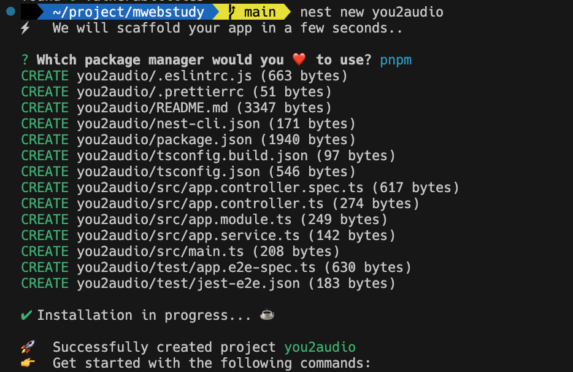
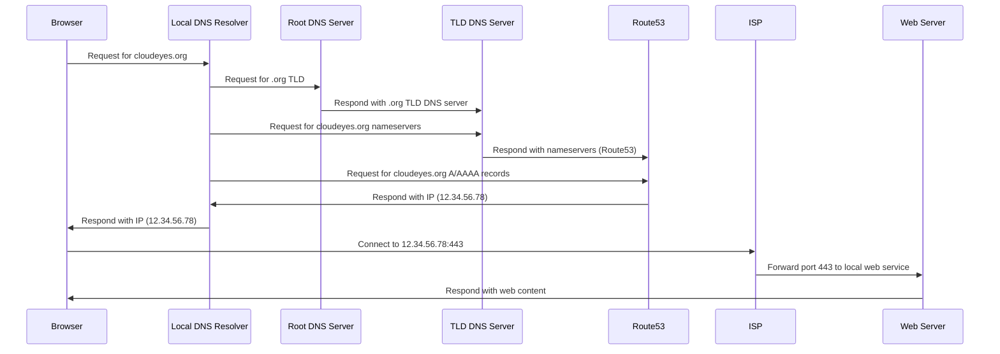

<!-- .slide: data-transition="fade" -->

## 모던웹 스터디

### 2주차 세미나

#### DOM의 이해

<small>(DOM - Document Object Model)</small>

<br/>

#### 김용기

<div style="font-size: 2rem; margin-top: 2rem">
MES팀 생산IT그룹

생산분석 UI 파트

<small>Mar, 19. 2023</small>

</div>

--

## Nest.js 따라하기

---

### 프로젝트 시작하기

`pnpm 선택하기`

```bash
$ npm i -g @nestjs/cli
$ nest new you2audio
$ cd you2audio
$ pnpm install
$ pnpm start:dev
$ nest g co download
```

---



--

## 브라우저가 URL을 찾는 과정



--

## 지난 세미나 리뷰

- JavaScript란?
  - ES6 (Modern JavaScript란?)
- Compile / Transpiling

--

## 오늘 할 이야기

- Youtube 숙제 이야기
- DOM 의 이해
- TypeScript 맛보기
- Full Stack JavaScript 서비스 맛보기
  - Nest.js 소개

--

### 개발자 로드맵

<iframe class="stretch" src="https://roadmap.sh/"></iframe>

<aside class="notes">
- https://github.com/kamranahmedse/developer-roadmap
</aside>
