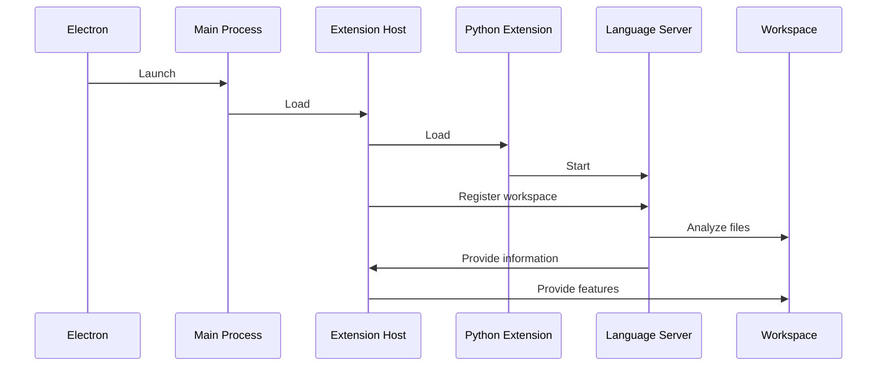
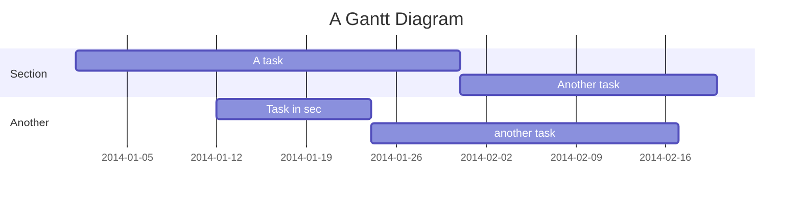
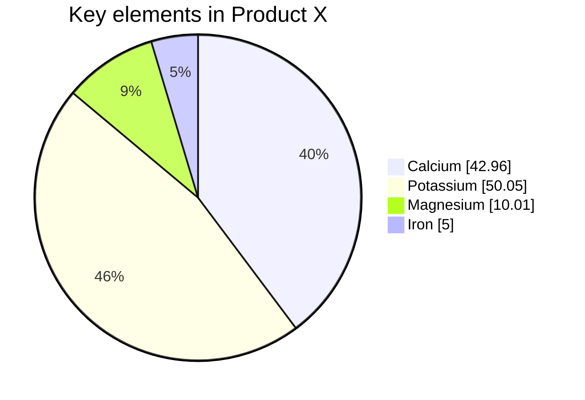
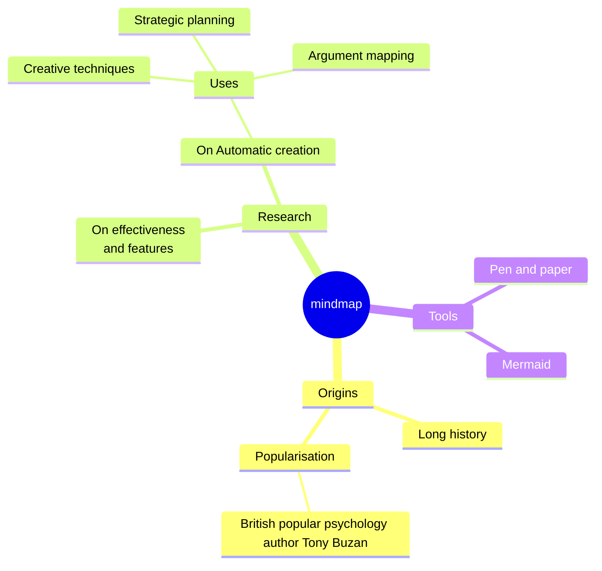
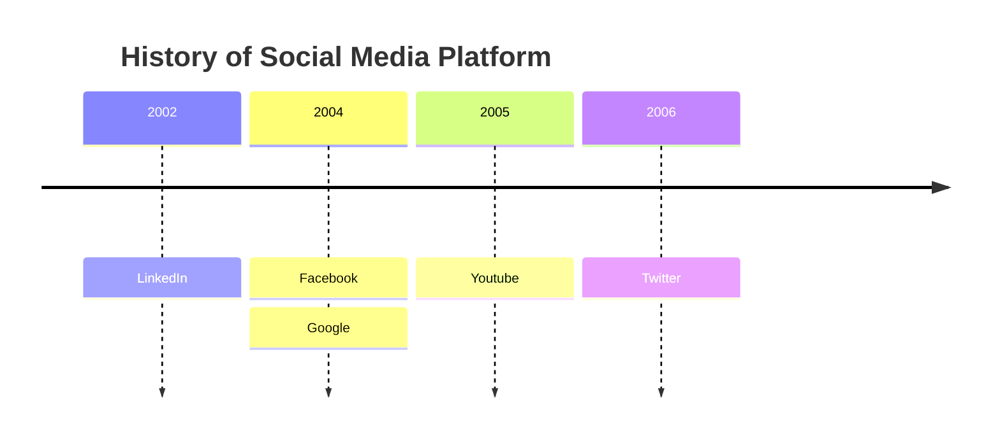

<!-- .slide: data-transition="fade" -->

## 모던웹 개발 플랫폼

### &nbsp;

#### &nbsp;

 

#### 김용기

MES팀 생산IT그룹

생산분석 UI 파트

<small>Feb, 27. 2023</small>

## 

--

<!-- .slide: data-transition="fade" -->

## 모던웹 업무 플랫폼

### &nbsp;

#### &nbsp;

 

#### 김용기

MES팀 생산IT그룹

생산분석 UI 파트

<small>Feb, 27. 2023</small>

--

<!-- .slide: data-transition="fade" -->

## 모던웹 통합 플랫폼

### 혁신의 FlyWheel {.fragment }

#### ChatGPT 시대의 생존 전략 {.fragment }

 

#### 김용기

MES팀 생산IT그룹

생산분석 UI 파트

<small>Feb, 27. 2023</small>

<aside class="notes">
지난 세미나에 이어 모던웹에 대해서 다시한번 발표하는 자리를 갖게 되었습니다.

지난 세미나가 최근 모던웹 동향과 가능성에 대해 전반적으로 살펴본 자리였는데요.

이번 세미나에서는 플랫폼의 관점에서 모던웹이 발전해온 원동력을 살펴보고, 그것을 “혁신의 플라이휠”이라는 관점으로 우리 회사와 조직에 적용할 방법을 같이 고민해보려 합니다. 혁신의 플라이휠이란 혁신이 스스로를 기반으로 하여 자기 강화적인 발전의 사이클을 만든다는 개념을 말합니다. 웹의 맥락에서 이는 모던웹의 등장으로 새로운 기술과 도구가 개발되고, 이를 통해 또 다른 혁신과 발전이 이루어진다는 것을 의미합니다.

</aside>

--

> ... 혁신의 플라이휠이란 혁신이 스스로를 기반으로 하여 **자기 강화적인 발전의 사이클**을 만든다는 개념을 말합니다.

---

## 도입

---

## Motivation

### 지난 2번의 세미나

- 1차: 11월: 실용주의 개발자를 위한 모던웹 기술 동향 {.fragment fade-up }
  - 고립된 웹 개발자를 모으기 위한 낚시(?) {.fragment fade-up }
  - 모던 웹 기술 개요 / MES Biz Studio 컨셉 {.fragment fade-up }
- 2차: 12월 - 모던웹으로 하나되는 DS {.fragment fade-up }
  - ChatGPT의 충격, 웹의 역사, 연결성의 관점에서 인간의 역할 {.fragment fade-up }
  - 브라우저 기반 개발 환경 동향 {.fragment fade-up }
    - 드론 어시스턴트 개발 환경 사례 {.fragment fade-up }

---

## Motivation

### 그리고 오늘

- 2달동안 개발한 모던웹 개발 플랫폼 PoC 소개 {.fragment fade-up }
  - 클릭 한 번으로 만들어지는 나만의 개발환경 {.fragment fade-up }
- 그리고 앞으로의 청사진: {.fragment fade-up }
  - Code-like IDE로 통합하는 모던웹 업무 환경 {.fragment fade-up }
  - AI 시대를 살아갈 지혜: AI-Driven, Cloud Native 조직 {.fragment fade-up }
    - 우리가 진화할 방향에 대한 이야기 {.fragment fade-up }

---

## 얼음 깨기

Ice Breaking

{ width=400px }

note: illustration. various kinds of crustacean which wear containers try to break the ice. Humorous

--

<!-- .slide: data-transition="fade" -->

### 킹크랩은 게가 아니다?

--

{ height=400px }

<small class="small-gray"><a href="https://www.youtube.com/watch?v=XWSnZD3Fy7g">슈카월드 (2022-06-29)</a></small>

--

<!-- .slide: data-transition="fade" -->

<iframe style="width: 100vw; height: 60vh" src="https://www.youtube.com/embed/uOK5J_M6kow" title="킹크랩은 가 가아니다." frameborder="0" allowfullscreen></iframe>

<a href="https://www.youtube.com/embed/uOK5J_M6kow">게도 아닌 게, 게같이 진화한 이유</a>

--

## 게화 : Carcinisation

- 우리가 아는 게의 형태 (단미하목)로 수렴진화했다는 가설

  - 살아남기 위해 꼬리가 짧아지고 등이 납작해짐
  - 생존에 유리한 모습으로 선택압에 적응했다고 함.

- 탈게화 (Decarcinisation)
  - 이에 대한 반박:
    - 종의 수가 많다고 반드시 진화적으로 성공한것은 아님

--

## 정리하면

<a href="https://namu.wiki/w/%EC%88%98%EB%A0%B4%20%EC%A7%84%ED%99%94" target="_blank">수렴 진화</a>

- 진화압이 경쟁이 극심한 환경에서
- 개체가 살아남기 위해 같은 모습을 진화하는 양상

<a href="https://namu.wiki/w/%EB%B0%9C%EC%82%B0%20%EC%A7%84%ED%99%94" target="_blank">발산 진화</a>

- 소수의 종이 경쟁자가 적은 지역으로 이주했을 경우
- 생태적 지위에 걸맞은 다양한 종으로 진화하는 현상

---

## Part I: IT 환경의 수렴진화

Convergent Evolution on IT

{ width=400px }

note: an clip art style transparent background outlined which depicts containerized IT gears like hermit crab which wears various kinds of containers like a shell and connected by a web-like mesh

---

## 컨테이너화

### Containerization { .fragment }

#### Containnovation (???) { .fragment }

- 컨테이너가 아니었던것이 { .fragment }
- IT 환경의 극심한 경쟁에 살아남기 위해 { .fragment }
- 컨테이너의 형태를 띄는 현상 { .fragment }

note: 가설에 불과한 게화를 소개한 이유는 이 현상을 빗대기 위함

--

### 컨테이너 기술이란?

- 가상화 기술 중 하나로
  - 하나의 호스트 시스템에서 여러 개의 컨테이너를 생성하여
  - 각각 독립된 환경에서 애플리케이션을 실행시키는 기술입니다.
- 장점
  - 가상 머신과 비교하여 더욱 가볍고 빠르며 리소스 사용량도 적음.

note: 컨테이너 기술은 가상화 기술 중 하나로, 하나의 호스트 시스템에서 여러 개의 컨테이너를 생성하여 각각 독립된 환경에서 애플리케이션을 실행시키는 기술입니다. 컨테이너는 가상화된 공간에서 실행되며, 호스트 시스템에서 실행되는 다른 애플리케이션과는 완전히 격리되어 있습니다.
컨테이너 기술은 가상 머신과 비교하여 더욱 가볍고 빠르며, 리소스 사용량도 적습니다. 가상머신은 운영체제를 포함한 전체 시스템을 가상화하기 때문에, 더 많은 자원을 필요로 합니다. 반면, 컨테이너는 호스트 시스템의 운영체제와 커널을 공유하며, 필요한 만큼의 자원만 사용합니다. 또한, 각각의 컨테이너는 서로 완전히 독립된 환경에서 실행되기 때문에, 애플리케이션 간의 충돌이나 영향을 최소화할 수 있습니다. 이를 통해, 개발팀은 애플리케이션을 보다 안정적이고 효율적으로 운영할 수 있게 됩니다.
컨테이너 기술은 또한 DevOps 문화와 밀접한 관련이 있습니다. 개발과 운영이 하나로 통합되어 있기 때문에, 컨테이너 기술을 활용하면 애플리케이션을 빠르게 빌드하고 배포할 수 있습니다. 이를 통해 개발팀과 운영팀 간의 협업을 원활하게 할 수 있으며, 애플리케이션을 보다 빠르고 안정적으로 배포할 수 있게 됩니다.
많은 IT 기업들이 컨테이너 기술을 활용한 Cloud Native 형태로 전환하고 있으며, 이는 앞으로 IT 비즈니스를 이끌어갈 중요한 요소 중 하나가 될 것입니다.

--

### 사례: 웹 기술이 컨테이너로?

--

### WebAssembly: 새로운 컨테이너 런타임

<iframe style="width: 100vw; height: 60vh" src="https://wasmlabs.dev/articles/docker-without-containers/"></iframe>

--

### 웹 어셈블리 컨테이너의 가능성

<!-- .slide: class="narrow" -->

> If WASM+WASI existed in 2008,
> we wouldn't have needed to create Docker. That's how important it is. WebAssembly on the server is the future of computing.

_Solomon Hykes (Docker 공동 설립자)_

--

### 기존 리눅스 커널 기반 컨테이너와 비교

- Portability
  - OS, CPU 아키텍처에 무관
- Security
  - 샌드박싱이 기본: 제한된 호스트 자원에만 접근 가능
- Efficiency:
  - 적은 메모리 공간, CPU 에서로 실행가능하도록 최적화 가능.
- Polyglot:
  - 40개 이상의 프로그래밍 언의 컴파일 타겟으로 지원.

--

### 사례 2: 웹 컨테이너

--

Node.js 로 개발된 앱을 구동 가능한 경량 런타임

- 브라우저에서 실행 가능한 컨테이너
- WebAssembly 표준: 웹 바이너리 런타임 기술 응용
  - Node.js 엔진이 웹 어셈블리로 구동되도록 포팅
- Node.js API 를 경량 컨테이너 커널로
  - 리눅스 커널 API를 Fully 구현하지 않아도
  - Node.js API만으로 웹 생태계는 거의다 실행 가능

--

#### 잠깐: Node.js 란?

_구글 크롬이 쏘아올린 작은 공_

- 2008년 Chrome 출시 당시 구글에서
- 강력한 V8 자바스크립트 엔진을 인수하여 오픈소스화
- Node.js 는
  - 이를 브라우저 밖에서 쓸 수 있도록 개량하여 탄생 (2009)
  - 자바스크립트가 파이썬 처럼 별도의 런타임과 생태계로 확장됨

--

<!-- .slide: data-transition="fade" -->

### 웹 컨테이너의 내부 동작 원리

--

<!-- .slide: data-transition="fade" -->

### 웹사이트

https://webcontainers.io

<iframe class="stretch" src="https://webcontainers.io" frameborder="0" allowfullscreen></iframe>

--

<!-- .slide: data-transition="fade" -->

### 사례 2: 웹 컨테이너

실행 예제

<video controls data-autoplay autoplay loop src="resources/videos/webcontainer-demo.mp4" preload="auto" plays-inline></video>

---

## 모던 UI 프레임워크

### Web-Frontification { .fragment }

--

### 모던 UI 프레임웍의 웹으로의 수렴진화

- Reactive 웹 프레임워크
- 마이크로프론트엔드
- 웹--화 (Web--Frontification)
  - Flutter / .NET MAUI / Uno Framework
- 웹 컴포넌트 표준

note: 너무 내용이바방대하니 리액티브 웹 프레임웍만 상세하게 다룰 예정입니댜.

--

### 리액티브 웹 프레임워크

{ height=500px}

--

::: .container

::: left

### Vue

<pre class="code-wrapper" style="width: 450px; height: 50vh; font-size: 0.8rem">
<code class="language-tsx">
<template>
  

    

      
{{ count }}

    

    

      <button class="button" @click="increment">+</button>
      <button class="button" @click="decrement">-</button>
    

  

</template>

</code>
</pre>

:::

::: right

### React

<pre class="code-wrapper" style="width: 450px; height: 50vh; font-size: 0.8rem">
<code class="language-tsx">
import { useState } from 'react';
import './App.css';

const CircleCounter = () => {
  const [count, setCount] = useState(0);
  const handleIncrement = () => setCount(count + 1);
  const handleDecrement = () => setCount(count - 1);

  return (
    

      

        
{count}

      

      

        <button style={styles.button} onClick={handleIncrement}>
          +
        </button>
        <button style={styles.button} onClick={handleDecrement}>
          -
        </button>
      

    

  );
};

const styles = {
  circle: {
    width: '100px',
    height: '100px',
    borderRadius: '50%',
    display: 'flex',
    justifyContent: 'center',
    alignItems: 'center',
    backgroundColor: 'blue',
  },
  text: {
    color: 'white',
  },
  buttonContainer: {
    display: 'flex',
    justifyContent: 'center',
    marginTop: '10px',
  },
  button: {
    margin: '0 5px',
    padding: '5px 10px',
    borderRadius: '5px',
    cursor: 'pointer',
  },
};

export default CircleCounter;

</code>
</pre>

--

::: .container

::: left

### Vue

<pre class="code-wrapper" style="width: 450px; height: 50vh; font-size: 0.8rem">
<code class="language-tsx">
<template>
  

    

      
{{ count }}

    

    

      <button class="button" @click="increment">+</button>
      <button class="button" @click="decrement">-</button>
    

  

</template>

</code>
</pre>

:::

::: right

### Svelte

<pre class="code-wrapper" style="width: 450px; height: 50vh; font-size: 0.8rem">
<code class="language-tsx">

  
{$count}

  <button class="button" on:click={increment}>+</button>
  <button class="button" on:click={decrement}>-</button>

</code>
</pre>

--

::: .container

::: left

### React

<pre class="code-wrapper" style="width: 450px; height: 50vh; font-size: 0.8rem">
<code class="language-tsx">

import { useState } from 'react';
import './App.css';

const CircleCounter = () => {
  const [count, setCount] = useState(0);
  const handleIncrement = () => setCount(count + 1);
  const handleDecrement = () => setCount(count - 1);

  return (
    

      

        
{count}

      

      

        <button style={styles.button} onClick={handleIncrement}>
          +
        </button>
        <button style={styles.button} onClick={handleDecrement}>
          -
        </button>
      

    

  );
};

const styles = {
  circle: {
    width: '100px',
    height: '100px',
    borderRadius: '50%',
    display: 'flex',
    justifyContent: 'center',
    alignItems: 'center',
    backgroundColor: 'blue',
  },
  text: {
    color: 'white',
  },
  buttonContainer: {
    display: 'flex',
    justifyContent: 'center',
    marginTop: '10px',
  },
  button: {
    margin: '0 5px',
    padding: '5px 10px',
    borderRadius: '5px',
    cursor: 'pointer',
  },
};

export default CircleCounter;

</code>
</pre>

:::

::: right

### Flutter

<pre class="code-wrapper" style="width: 450px; height: 50vh; font-size: 0.8rem">
<code class="language-dart">

import 'package:flutter/material.dart';

class CircleCounter extends StatefulWidget {
  const CircleCounter({super.key});

  @override
  State<CircleCounter> createState() => _CircleCounterState();
}

class _CircleCounterState extends State<CircleCounter> {
  int count = 0;

  void increment() {
    setState(() {
      count++;
    });
  }

  void decrement() {
    setState(() {
      count--;
    });
  }

  @override
  Widget build(BuildContext context) {
    return Scaffold(
      body: Column(
      mainAxisAlignment: MainAxisAlignment.center,
      children: [
        Container(
          width: Styles.circleWidth,
          height: Styles.circleHeight,
          decoration: Styles.circle,
          child: Center(
            child: Text(
              '$count',
              style: Styles.text,
            ),
          ),
        ),
        const SizedBox(height: 10),
        Row(
          mainAxisAlignment: MainAxisAlignment.center,
          children: [
            ElevatedButton(
              onPressed: increment,
              style: Styles.button,
              child: const Text('+'),
            ),
            const SizedBox(width: Styles.buttonsGap),
            ElevatedButton(
              onPressed: decrement,
              style: Styles.button,
              child: const Text('-'),
            ),
          ],
        ),
      ],
    ));
  }
}

class Styles {
  static final circle = BoxDecoration(
    borderRadius: BorderRadius.circular(50),
    color: Colors.blue,
  );

  static const circleWidth = 100.0;
  static const circleHeight = 100.0;
  static const buttonsGap = 5.0;

  static const text = TextStyle(
    color: Colors.white,
    fontSize: 24,
  );

  static final button = ElevatedButton.styleFrom(
    foregroundColor: Colors.white,
    backgroundColor: Colors.lightBlue,
    shape: RoundedRectangleBorder(
      borderRadius: BorderRadius.circular(5),
    ),
  );
}

</code>
</pre>

--

### 가짜 게 한마리 ?

--

### Flutter는 엄밀히 말해 웹이 아님

- 하지만 웹에서 실행되도록 컴파일됨 {.fragment}
  - Dart 언어의 빌드 타겟으로 WebAssembly 사용
- 렌더링: WebAssembly + Canvaskit (Skia) {.fragment}
  - 웹에서 평균 60프레임 고품질 애니메이션 / 반응성 제공

--

### Flutter 개발환경 Demo

웹 브라우저의 Inspector를 쏙 빼닮은 생김새.

<video controls data-autoplay autoplay loop src="resources/videos/flutter-dev-tools-demo.mp4" preload="auto" plays-inline></video>

--

### .NET MAUI

드디어 MAUI 타겟으로 Web 이 추가된다고 합니다.

[관련 레딧 기사와 댓글](https://www.reddit.com/r/csharp/comments/1194rdl/net_maui_for_web_is_coming/)

--

### .NET MAUI

자세한 내용은 여기서...

<iframe class="stretch" src="https://dotnet.microsoft.com/en-us/next"></iframe>

---

### 그 밖에 웹기술 동향

--

### 마이크로 프론트엔드 기술

- 최근 산업 표준의 수렴: 번들러에서 컴파일 타임 지원
  - WebPack / Vite의 Module Federation

<iframe class="stretch" src="https://ruslan.rocks/posts/vite-module-federation"></iframe>

--

#### single-spa: 라우터 방식 (에전 방식, 동적 연결)

[single-spa-login-example](https://github.com/jualoppaz/single-spa-login-example-with-npm-packages) (`admin` / `12345`)

<iframe class="stretch" src="https://single-spa.js.org/"></iframe>

--

### 웹 엔진에 Full Text 검색 통합.

웹사이트의 VSCode 화:

- 소스 검색처럼 번개같은 컨텐츠 검색:
- Incremental / 즉각적인 검색 결과 피드백
  - RipGrep / SilverSearcher

- [Algoria]()
- [Melisearch](https://github.com/meilisearch/meilisearch)
- [FlexSearch](https://github.com/nextapps-de/flexsearch)

--

### 웹 컴포넌트 표준

---

<!-- .slide: class="centered" -->

## 개발/업무 환경의 진화:

### Visual Studio Code { .fragment }

> Codeonification { .fragment }

--

### Code화: Codeonification(?)

- IDE 와 업무 환경이 VS Code의 형태를 따라가는 현상.
- IntelliJ 의 변화: Remote 개발 플러그인, UI/UX, 글로벌 검색
- Eclipse Theia

--

### Eclipse Theia란?

#### 메타 IDE 플랫폼

- VS Code형태의 모던웹 기반 IDE를 찍어낼 수 있는.
- VS Code 생태계와의 호환성을 설계부터 염두에 둠

--

### Eclipse Theia 살펴보기

<iframe class="stretch" src="https://theia-ide.org/"></iframe>

--

### 막간: 컨테이너 진화의 역사

<!-- .slide: class="narrow" -->

| 연도 | 설명                      | 성공 또는 실패의 이유                                                            |
| ---- | ------------------------- | -------------------------------------------------------------------------------- |
| 1979 | Version 7 Unix의 `chroot` | 제한된 격리 기능; 진정한 컨테이너 솔루션이 아님                                  |
| 2000 | FreeBSD의 `jails`         | 더 나은 자원 관리와 보안 기능을 갖춘 고급 컨테이너화                             |
| 2001 | Linux용 `vserver`         | 더 나은 격리 기능과 자원 관리                                                    |
| 2004 | Solaris의 `Zones`         | 더 나은 격리 기능과 자원 관리                                                    |
| 2008 | `LXC` (Linux Containers)  | 프로세스와 네트워크 격리가 가능한 완전한 컨테이너 솔루션, 하지만 이식성이 떨어짐 |

--

### 막간: 컨테이너 진화의 역사

<!-- .slide: class="narrow" -->

| 연도 | 설명                      | 성공 또는 실패의 이유                                                                                                |
| ---- | ------------------------- | -------------------------------------------------------------------------------------------------------------------- |
| 2013 | `Docker` 등장             | 컨테이너를 대중화시키고, 사용하기 쉬운 인터페이스와 이미지 기반의 컨테이너화 방식을 제공하여 보다 접근 가능하게 만듦 |
| 2015 | `rkt` (로켓이라고 발음함) | 보안을 중시하고 Docker보다 모듈화와 유연성을 더 많이 갖춘 솔루션                                                     |
| 2016 | `containerd`              | Docker와 Kubernetes를 비롯한 다양한 컨테이너 엔진에서 사용할 수 있는 컨테이너 런타임                                 |
| 2016 | `CRI-O`                   | Kubernetes에서 사용하기 위해 만들어진 솔루션으로, 보안과 성능에 중점을 둠                                            |
| 2016 | `Garden`                  | Pivotal에서 개발한 컨테이너 엔진으로, 보안과 확장성에 중점을 둠                                                      |

--

<!-- .slide: class="narrow" -->

| 연도 | 설명              | 성공 또는 실패의 이유                                                                    |
| ---- | ----------------- | ---------------------------------------------------------------------------------------- |
| 2018 | `Kata Containers` | 가상 머신의 보안 장점과 컨테이너의 성능 장점을 결합한 솔루션                             |
| 2020 | `Podman`          | 데몬 없이 작동하도록 개발된 컨테이너 엔진으로, 보안 제한이 있는 환경에서 사용하기 용이함 |

---

### 최근 기술 변화 동향

Cloud Native 로의 수렴 진화

---

### 기술 변화 동향

- 변하지 않는것: 도메인 모델링, 코어 비즈니스 서비스 모델
- 변하는 것:
  - 비즈니스 서비스 연결망
  - 아키텍처와 구현
- 극심한 변화
  - 사용자 뷰

---

## Visual Studio Code

### 동작 원리 살펴보기

---

## 웹: 혁신의 플라이휠

--

<!-- .slide: class="zoom" -->

--

### 동작 프로세스 사례

Python 프로젝트 로드하기

---

---

---

---

---

## 결론

### 연결망

--

## 모던웹 연구회

- 채널:
  - Notion: 사외 스터디 채널
- 주요 과제:
  - Code Server 구조 및 확장 개발 연구
  - 관련 브라우저 기반 기술 연구
    - Eclipse Che 등
